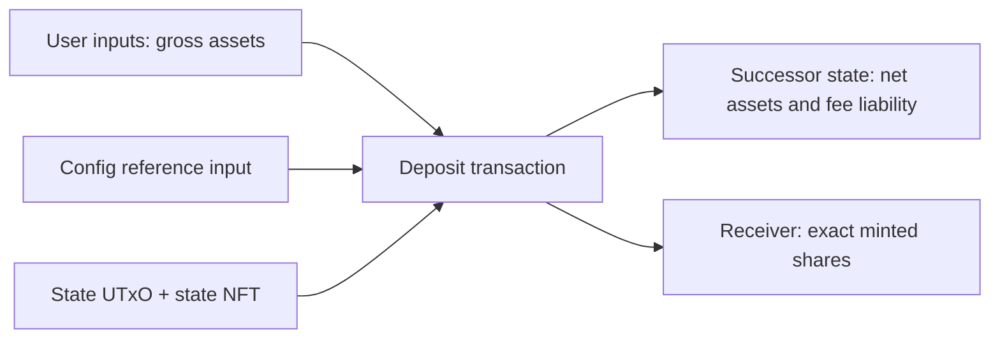

# CTVS-1 transaction shapes

## Authentication topology

The first production profile has four on-chain components:

```text
one-shot factory policy
  -> mints one immutable vault-ID NFT and one immutable state NFT

immutable config UTxO
  -> carries the vault-ID NFT and the inline VaultConfigV0 datum
  -> supplied as a reference input to normal actions

state validator
  -> locks exactly one continuing VaultStateV0 UTxO carrying the state NFT

share policy
  -> mints and burns the native share asset only alongside a valid state transition
```

The state NFT is the identity of the live state, not merely a label. A direct
action consumes exactly one UTxO containing it and creates exactly one
successor at the state validator address. A candidate UTxO without that NFT is
ignored. The config UTxO is immutable during the vault's life and binds the
state to a particular vault-ID NFT without making every direct action copy the
whole configuration datum.

## Immutable versus mutable fields

| Immutable config UTxO fields | Mutable state UTxO fields |
| --- | --- |
| format version, vault ID, state NFT, underlying, share asset | `total_assets` |
| virtual balances and `max_total_assets` | `accrued_fee_assets` |
| fee payout destination and fee rates | `total_shares` |
| pause authority and reserve-return destination | `state_storage_lovelace`, but only through `TopUpStateReserve` |
| config storage reserve and validator version | accounting epoch and pause status |

The exact datum and redeemer constructors are in
[`lib/ctvs/wire.ak`](../lib/ctvs/wire.ak). Its field order is deliberate. An
incompatible format is a new version, not an altered v0 datum.

## Closed state-value invariant

The direct-custody state output contains exactly the state NFT and, when the
underlying is non-ADA, that one underlying asset. It has no other native assets.
`total_assets` is the share-backed amount used by conversions. Fees are already
charged to the user but remain a separately tracked liability until collection.

```text
ADA underlying:
  state.lovelace
  = total_assets + accrued_fee_assets + state_storage_lovelace

Non-ADA underlying:
  state[underlying]
  = total_assets + accrued_fee_assets
  state.lovelace
  = state_storage_lovelace
```

The state address must have no staking credential in CTVS-1. The config and
reference-script outputs must also be separate from the state output so their
minimum-ADA requirements cannot change the share-backed accounting equation.
The immutable config output holds exactly the vault-ID NFT and its declared
`config_storage_lovelace`; reference scripts live in separate outputs.

## Common direct-action checks

Every direct transition must prove all of the following:

1. Exactly one authenticated config reference input and exactly one authenticated state input are present.
2. Exactly one successor state output retains the state NFT at the state validator address.
3. The config datum, vault-ID NFT, state NFT, and all immutable parameters match the deployment.
4. The successor satisfies the closed state-value equation.
5. `new_total_shares = old_total_shares + minted - burned`.
6. The declared action's quote is recomputed from the consumed state, never trusted from a client.
7. Each action produces a payment output matching its declared `OutputDestination` (address plus inline datum) with the required economic amount, and honors the action's user-supplied slippage bound, cap, pause status, and validity interval.
8. No value at the script address without the state NFT is included in custody accounting.

The share policy and state validator verify overlapping facts. Coupling both
stops a transaction from minting shares through a separate path or changing the
state supply counter without a matching mint or burn.

## Deposit

The caller supplies an exact gross asset amount and a minimum share amount.



Required facts:

- `shares_minted = quote_deposit(old_state, fees, gross_assets).shares`.
- `shares_minted >= min_shares`.
- `total_assets` increases by `net_assets` and `accrued_fee_assets` increases by `fee_assets`.
- The successor state value increases by the caller's gross asset contribution.
- The share policy mints precisely `shares_minted` of the configured share asset.
- A payment output matching `receiver` contains exactly `shares_minted` of the share asset. It may carry the receiver's declared inline datum; CTVS does not impose a receipt datum on that output.

## Mint

The caller specifies an exact share output and a maximum gross asset input.

```text
net_assets = convert_to_assets_up(target_shares)
gross_assets = net_assets + entry_fee
```

Required facts:

- `gross_assets <= max_assets`.
- The caller funds `gross_assets`.
- `total_assets` increases by `net_assets`; `accrued_fee_assets` increases by the entry fee.
- Exactly `target_shares` are minted to a payment output matching the declared receiver destination.

## Withdraw

The caller specifies an exact net asset output and a maximum share burn.

```text
gross_assets = net_assets + exit_fee
shares_burned = convert_to_shares_up(gross_assets)
```

Required facts:

- `shares_burned <= max_shares`.
- The owner authorizes the burn by providing the share-bearing inputs and signature, or later through a bounded capability.
- `total_assets` decreases by `gross_assets`; `accrued_fee_assets` increases by `exit_fee`.
- The receiver gets `net_assets` in a payment output matching the declared receiver destination. For a non-ADA underlying, the output contains exactly that many underlying tokens. For ADA, it contains at least that much lovelace and any excess is a non-vault minimum-output top-up.
- Exactly `shares_burned` are burned.

## Redeem

The caller supplies an exact share input and a minimum net asset output.

```text
gross_assets = convert_to_assets_down(shares_burned)
net_assets = gross_assets - exit_fee
```

Required facts:

- The owner authorizes the exact share burn.
- `net_assets >= min_assets`.
- `total_assets` decreases by `gross_assets`; `accrued_fee_assets` increases by `exit_fee`.
- The receiver gets `net_assets` in a payment output matching the declared receiver destination. For a non-ADA underlying, the output contains exactly that many underlying tokens. For ADA, it contains at least that much lovelace and any excess is a non-vault minimum-output top-up.

## Fee collection

`ClaimFees` is permissionless and claims the whole accrued balance. It sets
`accrued_fee_assets` to zero and removes that same economic amount from the
state value. It cannot change
`total_assets`, `total_shares`, virtual balances, limits, or status. It must
create a payout output matching the config's immutable payout destination.

For a non-ADA underlying, that output has exactly the accrued amount of the
underlying token. For ADA, it has at least the accrued amount. Any lovelace
above the economic fee is an external claimant-funded minimum-output top-up,
not an additional charge to the vault or its users. CTVS does not require a
`FeeReceipt` datum, because the destination may be a script that requires its
own inline datum. Indexers identify fee collection from the `ClaimFees`
redeemer and state delta.

## Authority and state reserve

Only `Pause` and `Resume` use the immutable `PauseAuthority`. A key authority
is checked in the transaction's signatories. A capability authority consumes
and recreates its configured token at its configured address, allowing a
separate script, multisig, or DAO to govern that token without CTVS defining
the governance mechanism.

`TopUpStateReserve` has no economic effect. It may only increase
`state_storage_lovelace` by the exact amount of external ADA entering the state
output. It cannot lower the reserve or modify any other accounting field.

## Limits and state freshness

`max_total_assets` is the v0 limit. A client derives a remaining `maxDeposit`
or `maxMint` from the identified state UTxO and this fixed cap. User-specific
limits are outside CTVS-1. An action built against an already-consumed state
reference is stale and must be rebuilt. The user gets an execution guarantee
only from the transaction's `min_shares` or `max_assets` bound, not from a
previously displayed conversion.
