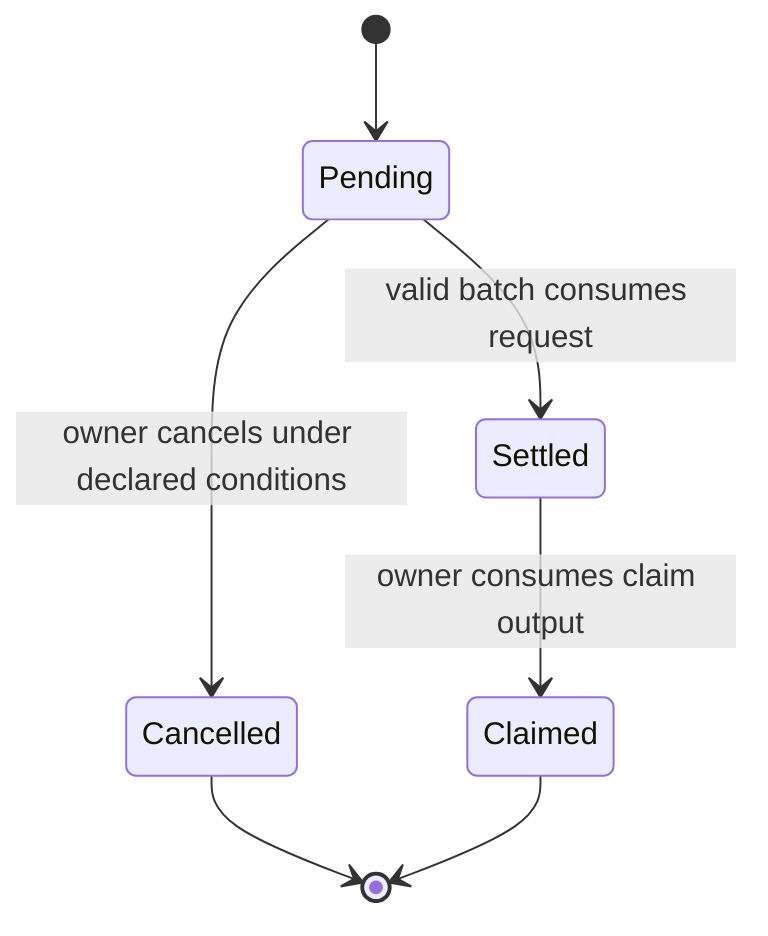

# CTVS-2 asynchronous extension

## Why this is separate

A direct action consumes the singleton state UTxO. Two users can construct direct transactions at the same time, but only one can consume that state output. The other transaction becomes stale.

CTVS-2 lets users create independent requests in parallel, then lets any eligible settler batch compatible requests with one state transition. It is an eUTxO-native request, settlement, and claim rail inspired by the purpose of ERC-7540.

## Request lifecycle



Each request must carry or derive:

```text
request_id = originating TxOutRef or authenticated request beacon
vault_id
request kind
receiver destination (address plus optional inline datum)
offered gross assets or shares
minimum acceptable output
settlement deadline
request storage lovelace
fixed settler reward lovelace
refund destination and rules
pricing epoch or snapshot rule
```

Identity must not be inferred from a transaction input or output position. A batch can reorder inputs and outputs, so positional matching would make the interface unsafe.

## Batch settlement requirements

A valid settlement transaction:

1. Consumes the authenticated state UTxO and a declared set of pending requests.
2. Identifies each request by its own ID and produces one uniquely linked claim output or direct receiver output matching the declared destination.
3. Applies one declared rate or pricing rule to the batch or epoch.
4. Enforces every request's minimum output, fixed settler reward, deadline, receiver destination, and offered amount.
5. Mints and burns aggregate shares exactly as the successor state requires.
6. Carries or refunds each request's storage reserve and returns any unused precommitted settler budget according to the documented policy.
7. Prevents a settled request from being replayed or claimed twice.

## Settler trust boundary

The settler constructs and submits transactions. The validators, not the settler, must enforce economics and ownership.

| A settler must not be able to | A settler may still be able to |
| --- | --- |
| Change receiver destination, amount, minimum output, or precommitted reward | Delay, ignore, or select among otherwise valid requests |
| Mint excess shares or omit necessary burns | Go offline and harm liveness |
| Use the wrong vault or stale pricing rule | Choose when to submit a valid batch |
| Replay a request or send claim proceeds to itself | Temporarily censor a user |

No base promise of global FIFO should be made. A validator can validate included requests, but it generally cannot prove that an older eligible request exists elsewhere in the UTxO set. The default CTVS-2 fairness policy should be equal treatment inside an authenticated batch or epoch, explicit ordering disclosure, fixed request-level settler rewards, and cancellation or permissionless fallback.

## Out of scope until CTVS-1 is reviewed

- Batch-size and execution-unit limits.
- Partial settlement rules.
- Settler reward allocation beyond the fixed request-level budget and dust handling.
- Competing settler incentives.
- Managed-NAV report selection and freshness checks.
- A DEX-specific scooper adapter.

These are essential engineering decisions, but folding them into the synchronous standard would overcomplicate the initial review surface.
